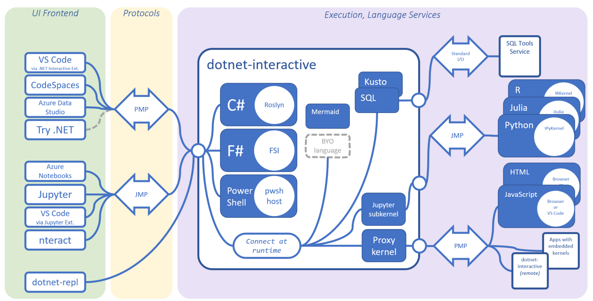

# แนะนำ Polyglot (.NET Interactive) 

Polyglot (.NET Interactive) เป็นสภาพแวดล้อมที่อาศัย kernel ที่ทำงานกับภาษาโปรแกรมต่าง ๆ จำนวนหนึ่ง เช่น C#, F#, Javascript, Python มาทำงานร่วมกันอย่างมีประสิทธิภาพ ซึ่งช่วยให้เราสามารถผสมผสานภาษาโปรแกรมต่าง ๆ เข้าด้วยกันในโปรเจคเดียว โดยอาศัยแพลตฟอร์ม .NET เป็นแกนหลัก ช่วยให้เราสามารถใช้ประโยชน์จากจุดแข็งของภาษาต่าง ๆ  ในการแก้ไขปัญหาที่ซับซ้อนได้อย่างเต็มที่

## สถาปัตยกรรม Polyglot

แนวคิดของสถาปัตยกรรมของ Polyglot .NET Interactive นั้น ถูกออกแบบมาเพื่อรองรับการทำงานร่วมกันของภาษาโปรแกรมที่หลากหลาย โดยมีองค์ประกอบหลักๆ ดังนี้

|รายการ|รายละเอียด|
--|--
**.NET Interactive Engine** | .NET Interactive Engine คือหัวใจสำคัญของระบบ เป็นส่วนที่รับผิดชอบในการประมวลผลโค้ดที่เขียนด้วยภาษาต่างๆ และส่งผลลัพธ์กลับมาให้ผู้ใช้
**Language Servers** | แต่ละภาษาจะมี Language Server เป็นของตัวเอง ซึ่งทำหน้าที่ให้บริการเกี่ยวกับภาษา เช่น การเติมโค้ดอัตโนมัติ การตรวจสอบไวยากรณ์ และการให้คำแนะนำต่างๆ
**Notebook Kernel** |เป็นส่วนที่เชื่อมต่อระหว่าง .NET Interactive Engine กับ notebook interface (เช่น Jupyter Notebook) ทำหน้าที่รับคำสั่งจาก notebook และส่งผลลัพธ์กลับไป
**Data Sharing**|กลไกที่ช่วยให้ข้อมูลสามารถถูกส่งผ่านระหว่างเซลล์ที่เขียนด้วยภาษาต่างๆ ได้ ทำให้เราสามารถใช้ข้อมูลจากภาษาหนึ่งไปประมวลผลในอีกภาษาหนึ่งได้
**Visualization**|รองรับการแสดงผลข้อมูลในรูปแบบต่างๆ เช่น กราฟ ตาราง เพื่อให้เราสามารถวิเคราะห์ผลลัพธ์ได้ง่ายขึ้น

### ข้อดีของสถาปัตยกรรม Polyglot

- มีความยืดหยุ่นสูง  สามารถรองรับภาษาโปรแกรมได้หลากหลาย
- ประสิทธิภาพสูง เนื่องจากอาศัย .NET Runtime ซึ่งเป็น runtime ที่มีประสิทธิภาพสูง
- การทำงานร่วมกันระหว่างภาษาต่างๆ ได้ดี ข้อมูลสามารถถูกส่งผ่านระหว่างภาษาต่างๆ ได้อย่างราบรื่น
- สามารถพัพัฒนาได้ง่าย มีเครื่องมือและไลบรารีที่ช่วยให้การพัฒนาแอปพลิเคชันด้วย Polyglot .NET Interactive ง่ายขึ้น

### การประยุกต์ใช้ Polyglot 

.NET Interactive สามารถนำไปประยุกต์ใช้ได้ในหลากหลายด้าน เช่น

- **วิทยาศาสตร์ข้อมูล (Data science)**
ใช้ Python สำหรับการวิเคราะห์ข้อมูลเชิงสถิติ และใช้ C# หรือ F# สำหรับการสร้างโมเดล Machine Learning
- **พัฒนาเว็บแอปพลิเคชัน** 
ใช้ C# สำหรับส่วน Back-end และใช้ JavaScript หรือ TypeScript สำหรับส่วน Front-end
- **เกม**
ใช้ C# สำหรับส่วนหลักของเกม และใช้ภาษาอื่นๆ เช่น Lua สำหรับการสร้างสคริปต์ภายในเกม
- **การเรียนรู้ภาษาใหม่ หรือ Framework ใหม่ ๆ**
ทดลองเล่นกับภาษาใหม่ ๆ เพื่อเรียนรู้ไวยากรณ์และคุณสมบัติต่างๆ 

การนำ kernel ที่หลากหลายมาใช้ในการเขียนโปรแกรม ทำให้เราสามารถนำความรู้ความสามารถมาใช้ในการแก้ปัญหาผ่านการทดลองที่หลากหลาย เพื่อประโยชน์ในด้านต่างๆ เช่น

- **การทำต้นแบบอย่างเร่งด่วน (Rapid Prototyping)**
1. การทดสอบแนวคิดใหม่ ๆ โดยการสร้างโปรโตไทป์อย่างรวดเร็วเพื่อทดสอบแนวคิดใหม่ ๆ หรืออัลกอริทึมต่าง ๆ โดยใช้ภาษาที่เหมาะสมกับงานนั้น ๆ โดยไม่ต้องกังวลกับการเสียเวลาในการจัดเตรียมสภาพแวดล้อม
2. การเปรียบเทียบประสิทธิภาพของภาษาต่างๆ ในการแก้ไขปัญหาเดียวกัน เพื่อเลือกภาษาที่เหมาะสมที่สุดสำหรับโครงการจริง
3. การสำรวจไลบรารีและเฟรมเวิร์ก ด้วยการทดลองใช้ไลบรารีและเฟรมเวิร์กใหม่ๆ ที่เขียนด้วยภาษาต่าง ๆ เพื่อหาเครื่องมือที่เหมาะสมกับงาน
   
- **การสร้างสคริปต์อัตโนมัติ**
ในการประมวลผลข้อมูล เราอาจทดลองสร้างสคริปต์เพื่อประมวลผลข้อมูลขนาดใหญ่ โดยใช้ภาษาที่เหมาะสมกับการจัดการข้อมูล เช่น Python  

- **สร้างรายงาน**
สร้างรายงานที่ปรับแต่งได้โดยใช้ภาษาที่เหมาะสมกับการสร้างภาพ เช่น F#

- **การทำงานที่ต้องทำซ้ำบ่อย ๆ โดยอัตโนมัติ**
polyglot เหมาะสำหรับงานที่ต้องทำซ้ำๆ เช่น การสร้างไฟล์ การทดสอบ หรือการปรับใช้โค้ด

- **สร้างเครื่องมือสำหรับงานเฉพาะทาง** สร้างเครื่องมือที่ปรับแต่งได้สำหรับงานเฉพาะทาง เช่น การวิเคราะห์ข้อมูล การสร้างโมเดล หรือการสร้างภาพ

