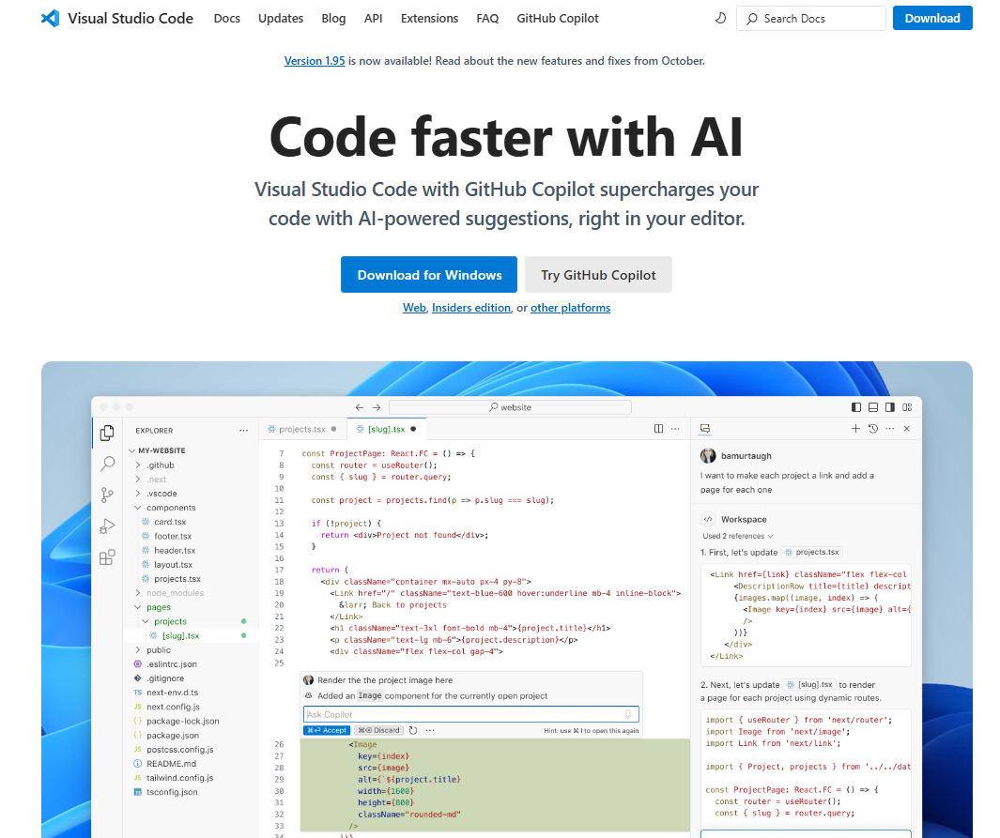
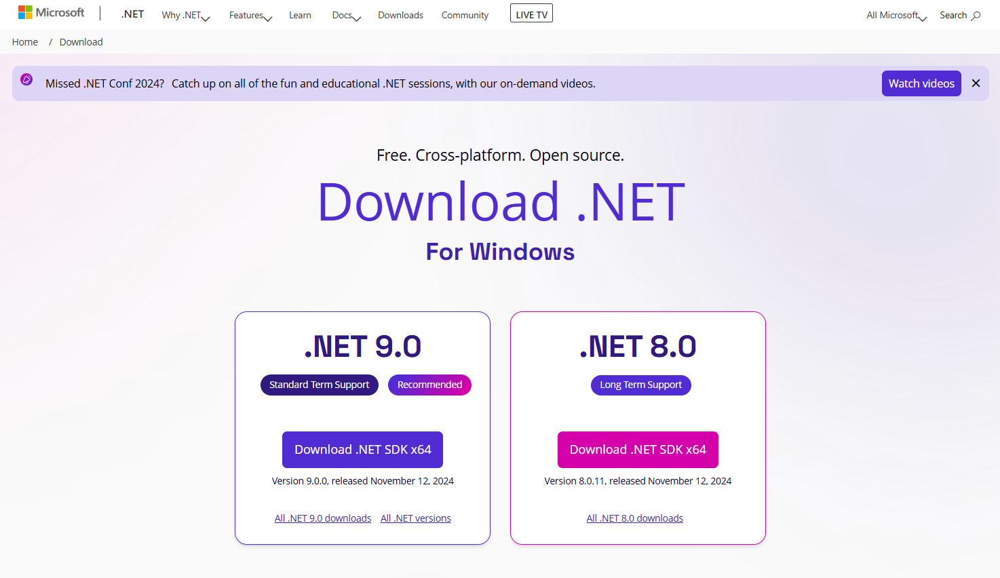

# การติดตั้ง Polyglot (.NET Interactive) 

ขั้นตอนการติดตั้ง Polyglot ง่าย ๆ ใน 3 ขั้นตอนหลัก

1. ติดตั้ง Visual Studio Code:

ถ้าหากยังไม่ได้ติดตั้ง Visual Studio Code บนเครื่อง 

ให้ดาวน์โหลดและติดตั้งได้จากเว็บไซต์ทางการ: https://code.visualstudio.com/

2. ติดตั้ง .NET SDK:

เพื่อให้ทำงานได้ราบรื่นจากตัวอย่างในชั้นเรียนหรือจากแหล่งต่างๆ ให้ ติดตั้ง .NET SDK เวอร์ชันล่าสุด เว้นเสียแต่ทางเจ้าของ code แนะนำว่าควรเป็นเวอร์ชั่นอื่นๆ 

สามารถดาวน์โหลดได้จาก: https://dotnet.microsoft.com/download

3. ติดตั้ง Extension Polyglot Notebooks

 