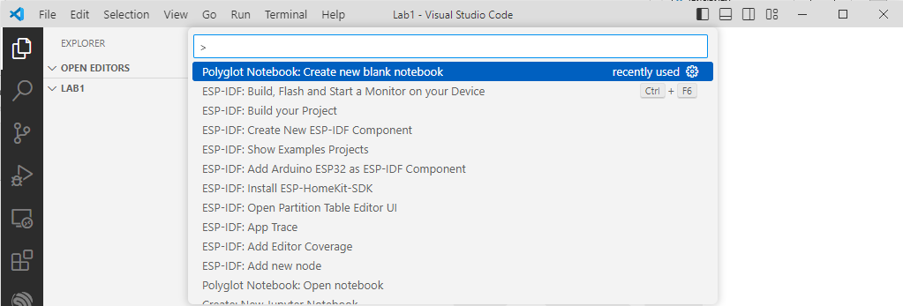
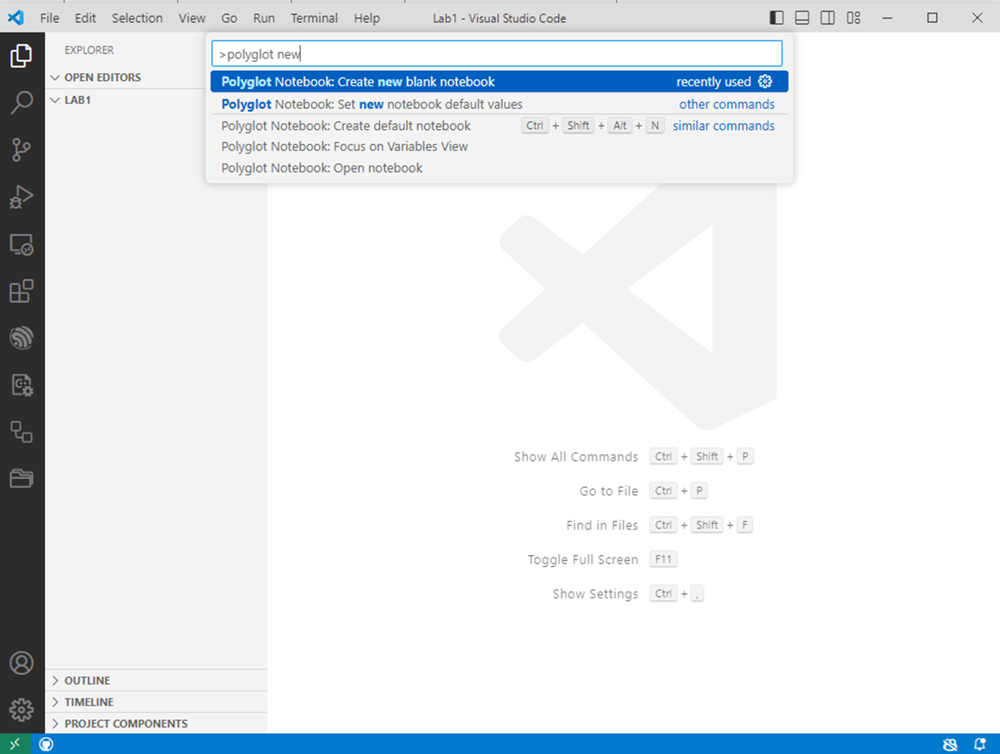
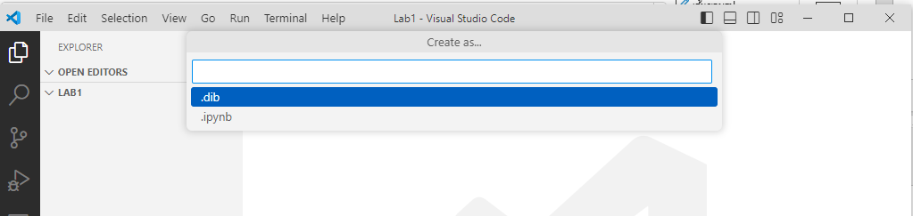
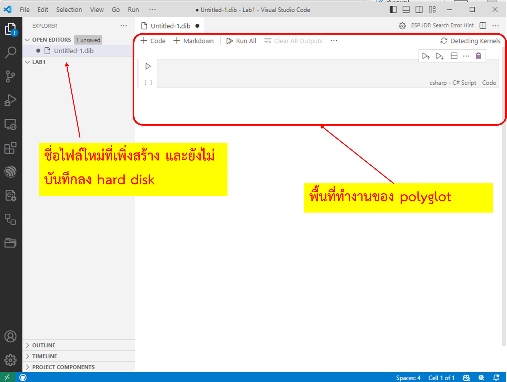
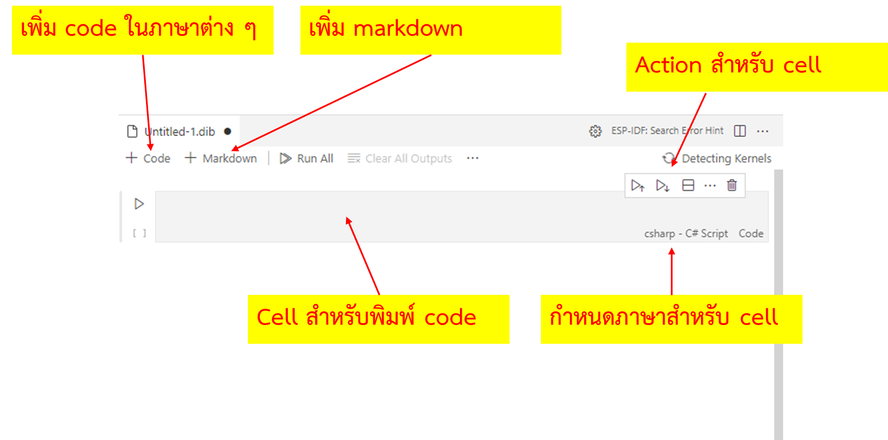
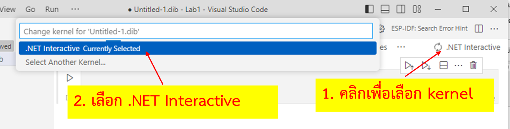
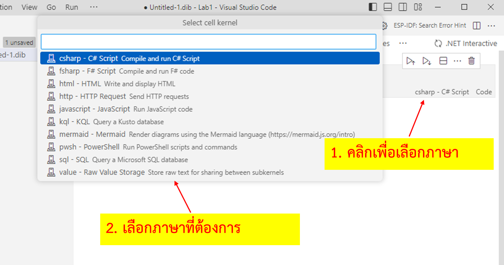

# การเริ่มใช้งาน Polyglot (.NET Interactive) 

1. ใน vscode ให้กด Ctrl+Shift+P (Windows, Linux) หรือ Cmd+Shift+P (macOS) เพื่อเปิด command pallette หรือสามารถเรียกจากเมนู View -> Command Palette...
   

2. พิมพ์ `polyglot new` ลงในช่องคำสั่ง ระวังอย่าลบเครื่องหมาย `>` ที่ด้านหน้า

3. คลิกเลือกที่ `Polyglot Notebook: Create new blank notebook`

 

4. คลิกเลือกภาษา `C#`

Extension ของ vscode จะสร้างไฟล์ notebook ขึ้นมา โดยมีภาษาเริ่มต้นเป็นภาษา C# 

เราสามารถเลือกภาษาได้ในตอนเริ่มสร้าง notebook

เราสามารถระบุภาษาที่เขียนได้โดยใช้ magic command (จะยกตัวอย่างในข้อต่อไป)

### Cell สำหรับ Notebook

เมื่อสร้าง notebook เราสามารถเพิ่ม cell เพื่อที่จะบรรจุเนื้อหาสำหรับ notebook ได้ โดยเบื้องต้นจะกำหนดได้ 2 รูปแบบคือ ภาษาโปรแกรม และ markdown (ในลักษณะเดียวกับ github markdown)

### การเลือก Kernel

ในการใช้งาน cell จะต้องเลือก kernel เพื่อที่จะให้ language services สามารถทำงานได้อย่างถูกต้อง โดยแต่ละ kernel ที่ติดตั้งจะรองรับภาษาที่แตกต่างกันไป

### การเลือก ภาษาสำหรับ cell

ขั้นตอนต่อไปคือการเลือกภาษาที่จะเขียนใน cell ซึ่ง polyglot มีให้เลือกหลายภาษาด้วยกัน 

อย่างไรก็ตาม  เราสามารถเขียนหลายภาษาลงใน cell เดียวกัน โดยต้องระบุชื่อของภาษาด้วย magic command 

